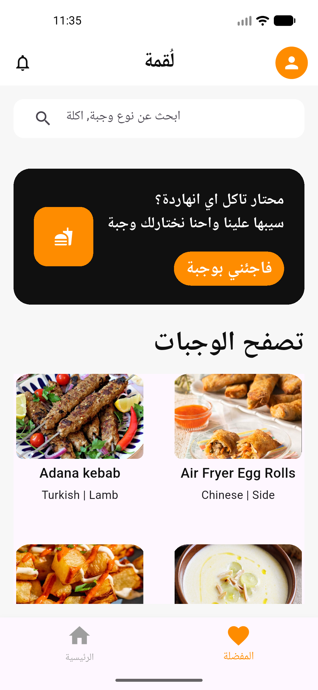
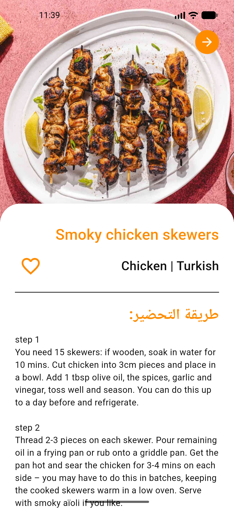
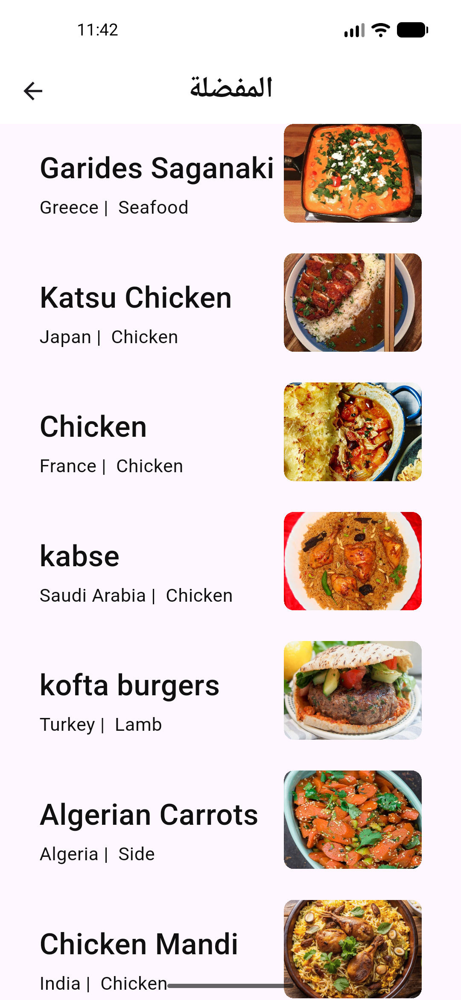
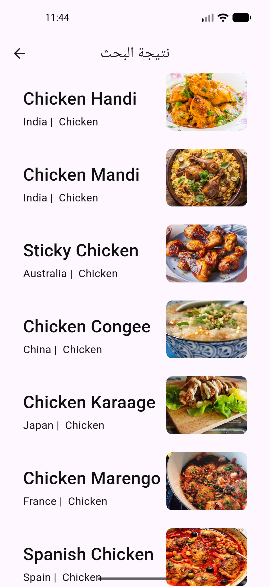

<div align="center">

# 🍔 Lo'ma
### Flutter Food Discovery App

A cross-platform mobile app for discovering meals, getting random suggestions, searching recipes, and saving favorites — built on a clean, scalable architecture with a real-world REST API.

<p>
  
  
  
  
</p>

</div>

---

## 📖 Overview

Lo'ma is a fully functional food/recipe app consuming [TheMealDB API](https://www.themealdb.com/). It was built to apply solid mobile engineering practices end to end — clean separation of concerns, type-safe API models, two distinct local persistence strategies, and a navigation system with authentication guarding. The goal wasn't just screens wired to an API, but a codebase structured the way a production app would be.

---

## ✨ Features

| | |
|---|---|
| 🏠 **Smart Home Feed** | Random meal suggestion + browsable meal grid on launch |
| 🔍 **Live Search** | Search recipes by name directly against the API |
| 📖 **Meal Details** | Ingredients with measurements, full instructions, category/area, and a direct YouTube tutorial link |
| ❤️ **Favorites** | Save/remove meals with instant UI updates, persisted across app restarts |
| 🔐 **Auth Flow** | One-time onboarding + login-gated routing — protected screens are unreachable without signing in |
| 🌐 **Resilient Networking** | Graceful handling of missing images, empty results, and failed requests |

---

## 🏗️ Engineering Highlights

What this project focuses on is *how* it works, not just that it works.

**Layered Architecture**
Models, services, and UI are fully decoupled — a `fromJson` parsing layer feeds a typed service layer, which feeds reusable, generic widgets. No business logic lives inside the UI.

**Two Storage Strategies, Used Deliberately**
- `SharedPreferences` for lightweight flags (e.g. first-launch state)
- `Hive` (NoSQL, code-generated adapters) for structured favorite-meal objects, with reactive UI updates via `ValueListenableBuilder` — favorites update instantly with zero manual refresh logic

**Reusable Generic Widgets**
A single `FutureBuilder`-based widget handles loading/error/empty states across multiple screens, with the card layout injected via a builder function — one component, multiple contexts.

**Route Protection with GoRouter**
A `redirect` callback enforces auth state on *every* navigation event, not just on initial load — closing the gap where a logged-out user could otherwise deep-link directly into a protected route.

**Defensive UI**
Null/empty image URLs, malformed API responses, and real layout edge cases (RTL text, dynamic content height, overflow) are handled explicitly rather than assumed away.

---

## 🛠️ Tech Stack

| Layer | Tools |
|---|---|
| Framework | Flutter & Dart |
| Navigation | GoRouter (auth-aware redirects) |
| Networking | Dio + Pretty Dio Logger |
| Local Storage | Hive (favorites) · SharedPreferences (app flags) |
| Images | CachedNetworkImage |
| Responsive UI | flutter_screenutil |

---

## 🚀 Getting Started

```bash
git clone https://github.com/YoussefNasr2005/small_food_app.git
cd small_food_app
flutter pub get
dart run build_runner build --delete-conflicting-outputs
flutter run
```

---

## 👤 Author

**Youssef Nasr**
Flutter Developer

[](https://github.com/YoussefNasr2005)
[](https://linkedin.com/in/youssef-nasr-5a3a93358)
