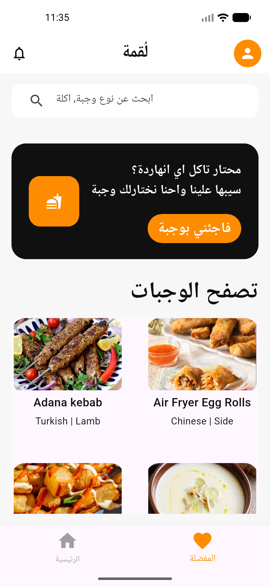
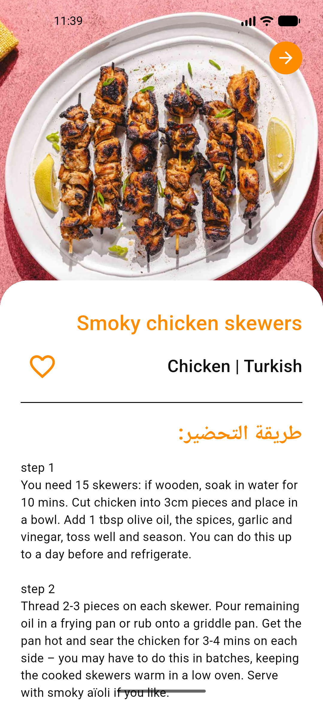
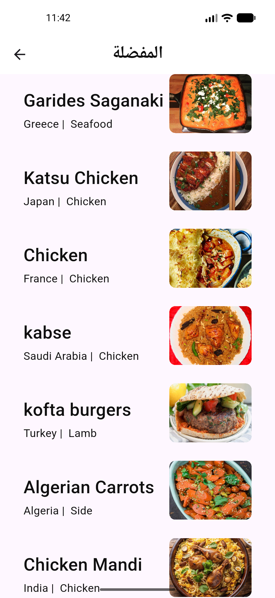
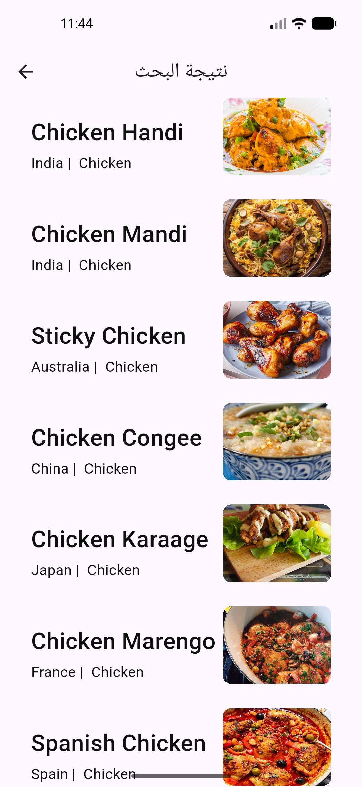

<div align="center">

# 🍔 Lo'ma

### Flutter Food Discovery App

A cross-platform Flutter application for discovering meals, searching recipes, and managing favorites — built with **flutter_bloc (Cubit)**, a scalable architecture, and a real-world REST API.

<p>
  
  
  
  
</p>

</div>

---

# 📖 Table of Contents

- [Overview](#-overview)
- [Features](#-features)
- [Engineering Highlights](#-engineering-highlights)
- [Tech Stack](#️-tech-stack)
- [Architecture](#-architecture)
- [Getting Started](#-getting-started)
- [Recent Improvements](#-recent-improvements)
- [Author](#-author)

---

# 📖 Overview

**Lo'ma** is a Flutter food discovery application powered by **TheMealDB API**. Originally built as an API integration project, it was later refactored to use **flutter_bloc (Cubit)**, resulting in a cleaner, more maintainable, and reactive architecture.

The project focuses on building a production-style Flutter application with clear separation of concerns, scalable state management, efficient local persistence, and a responsive user experience.

---

# ✨ Features

| Feature | Description |
|----------|-------------|
| 🏠 Smart Home Feed | Displays a random featured meal alongside a browsable meals list |
| 🎲 Random Meal Generator | Discover a completely random meal with a single tap |
| 🔍 Live Search | Search meals by name directly from TheMealDB API |
| 📖 Meal Details | View ingredients, measurements, cooking instructions, category, area, and a YouTube tutorial |
| ❤️ Favorites | Save and remove favorite meals with instant UI updates using Hive |
| 🚀 Smart App Flow | First-launch onboarding with SharedPreferences and GoRouter redirects |
| ⚡ Reactive UI | Screens automatically rebuild in response to Cubit state changes |
| 🌐 Error Handling | Gracefully handles API failures, missing images, and empty responses |

---

# 🏗️ Engineering Highlights

### 🧩 State Management with Cubit

The networking flow was refactored from a `FutureBuilder`-based implementation to **flutter_bloc (Cubit)**.

Business logic is now separated from the presentation layer, resulting in cleaner widgets, improved readability, and easier maintenance.

---

### 🏛 Layered Architecture

The project follows a simple layered architecture consisting of:

- Presentation
- Cubits
- Services
- Networking

Each layer has a clear responsibility, making the application easier to understand and extend.

---

### 🔄 Reactive State-Driven UI

Instead of manually handling asynchronous operations with `FutureBuilder`, screens react automatically to emitted Cubit states.

This significantly reduces duplicated asynchronous UI code and keeps widget implementations focused on presentation.

---

### ♻️ Reusable UI Components

Reusable widgets are used throughout the application to minimize duplicated UI code and simplify screen implementation.

This approach improves consistency while making the codebase easier to maintain and extend.

---

### 💾 Local Persistence

Different storage solutions are used based on their intended purpose.

| Storage | Purpose |
|----------|----------|
| Hive | Persist favorite meals |
| SharedPreferences | Store first-launch state |

---

### 🛡️ Defensive UI

The application safely handles:

- Missing images
- Empty API responses
- Network failures
- Dynamic content
- RTL layouts

to provide a stable user experience.

---

# 🛠️ Tech Stack

| Layer | Technology |
|---------|------------|
| Framework | Flutter & Dart |
| State Management | flutter_bloc (Cubit) |
| Navigation | GoRouter |
| Networking | Dio + Pretty Dio Logger |
| Local Storage | Hive + SharedPreferences |
| Image Loading | CachedNetworkImage |
| Responsive UI | flutter_screenutil |

---

# 🏛 Architecture

```text
Presentation (Screens)
        │
        ▼
      Cubits
        │
        ▼
     Services
        │
        ▼
     Dio Client
        │
        ▼
   TheMealDB API
```

### Layer Responsibilities

- **Presentation** — Displays the user interface and reacts to Cubit states.
- **Cubits** — Manage application state and coordinate business logic.
- **Services** — Handle communication with the API and return parsed models.
- **Dio Client** — Executes HTTP requests and receives responses.
- **TheMealDB API** — Provides meal data through a REST API.

---

# 🚀 Getting Started

```bash
git clone https://github.com/YoussefNasr2005/small_food_app.git

cd small_food_app

flutter pub get

dart run build_runner build --delete-conflicting-outputs

flutter run
```

---

# 🚀 Recent Improvements

- ✅ Refactored networking from `FutureBuilder` to **flutter_bloc (Cubit)**.
- ✅ Adopted a reactive, state-driven architecture.
- ✅ Removed repetitive asynchronous UI code.
- ✅ Simplified screen implementations and improved readability.
- ✅ Improved separation between business logic and presentation.
- ✅ Enhanced maintainability and scalability.
- ✅ Organized state management for a cleaner project structure.

---

# 👨‍💻 Author

**Youssef Nasr**

Flutter Developer passionate about building clean, scalable, and maintainable mobile applications.

[](https://github.com/YoussefNasr2005)

[](https://linkedin.com/in/youssef-nasr-5a3a93358)
